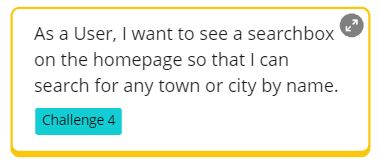
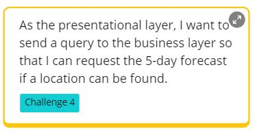
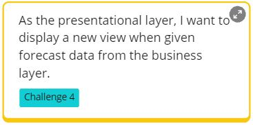
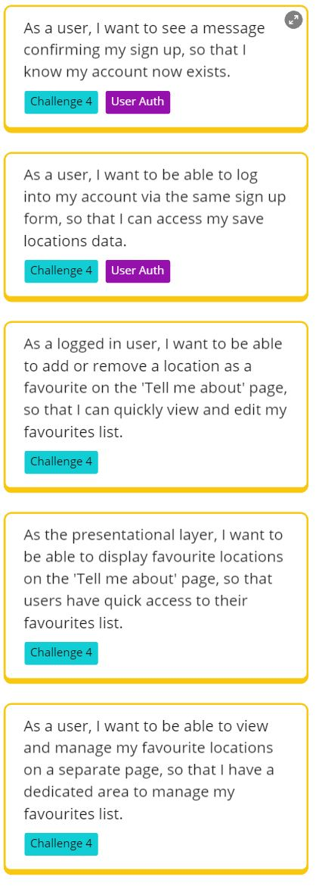
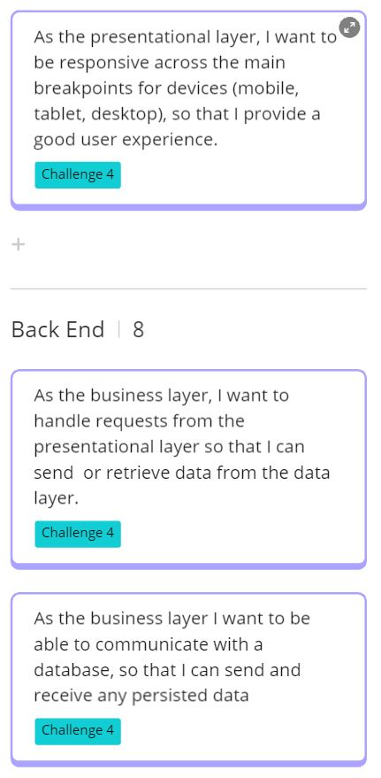
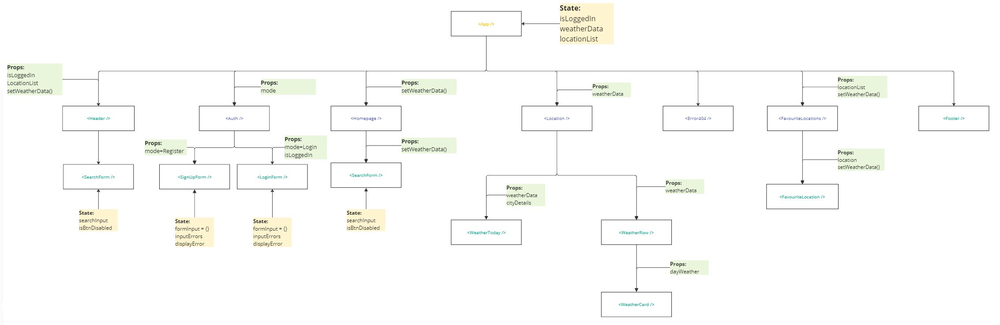
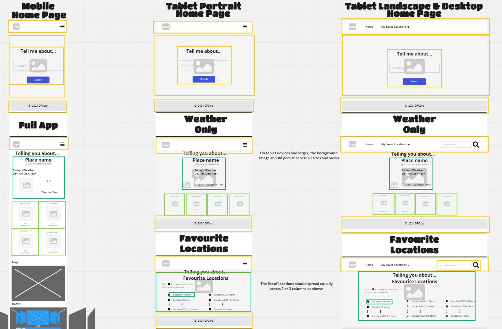
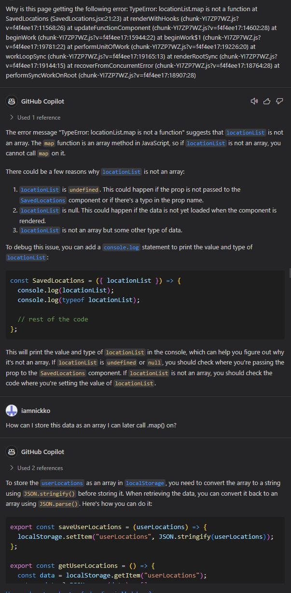
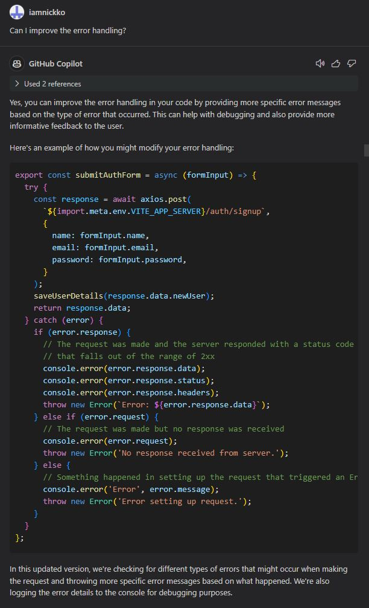

# Travel Info FrontEnd

A React application created with Vite that displays the data presented by the accompanying back end service built with Node.js, MongoDB and Express.js. The user interface for this MERN full stack project.

Go to:
- [Travel Info FrontEnd](#travel-info-frontend)
    - [User Stories](#user-stories)
      - [User Story 1](#user-story-1)
      - [User Story 2](#user-story-2)
      - [User Story 3](#user-story-3)
      - [User Story 4](#user-story-4)
      - [User Story 5-9](#user-story-5-9)
      - [User Story 10-12](#user-story-10-12)
    - [Component Hierarchy](#component-hierarchy)
    - [Further Development](#further-development)
    - [Generative AI](#generative-ai)
      - [SE\_CC\_2\_3](#se_cc_2_3)
      - [SE\_CC\_3\_2](#se_cc_3_2)

---

### [User Stories](#user-stories)
#### User Story 1

#### User Story 2

#### User Story 3

#### User Story 4

#### User Story 5-9

#### User Story 10-12

---

### [Component Hierarchy](#component-hierarchy)

---

### [Further Development](#further-development)
From a security concern, improvements can be made on the current storage solution of accessTokens and user data during sessions on the browser. Though already implementing JWT authentication, details are currently stored in the browser's local storage and area easily subject to manipulation. Upgrading this form of storage into a Cookies based solution will be a logical next step.

Migrating the weather api calls from away from the front end and making the calls by proxy from the backend would be the next suggested improvement. Having the api calls made from the backend further reduces the amount of potential code that is vulnerable to manipulation from malicious users.

This extra security will allow for better scaling when introducing more third-party APIs that could further add value to the application. Risks will increase as the system interacts with more third party apis, but this can be managed and minimised by implementing the aforementioned improvements of Cookie based sessions and proxy calls from the server.

Other APIs that could be incorporated with this new application could include hotel suggestions that are located at a users saved location - perhaps they are are thinking about holidaying at a new location and need accommodation suggestions. Alternatively, DFCorp could integrate their existing address book application and allow logged in users to associate specific contacts to saved locations or hotels as they begin to flesh out holiday plans with friends. There could be opportunity to create a social sharing aspect to this application.

---

### [Generative AI](#generative-ai)

#### SE_CC_2_3

#### SE_CC_3_2

---